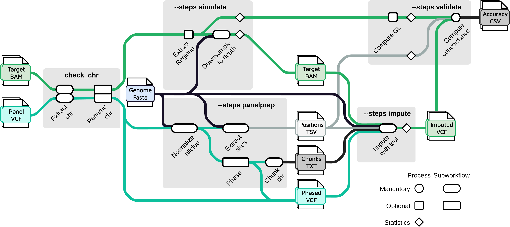

# 

**Nf-core pipeline for phasing and imputing genomic data.**.

[](https://github.com/nf-core/phaseimpute/actions)
[](https://github.com/nf-core/phaseimpute/actions)
[](https://www.nextflow.io/)

[](http://bioconda.github.io/)
[](https://hub.docker.com/r/nfcore/phaseimpute)

## Introduction

The pipeline is built using [Nextflow](https://www.nextflow.io), a workflow tool to run tasks across multiple compute infrastructures in a very portable manner. It comes with docker containers making installation trivial and results highly reproducible.

## Main steps of the pipeline

The **phaseimpute** pipeline is constituted of 5 main steps:

| Metro map |    Modes    |
|-----------|-------------|
|  | - **Pre-processing**: Phasing, QC, variant filtering, variant annotation of the reference panel <br> - **Phase**: Phasing of the target dataset on the reference panel <br> - **Simulate**: Simulation of the target dataset from high quality target data <br> - **Concordance**: Concordance between the target dataset and a truth dataset <br> - **Post-processing**: Variant filtering based on their imputation quality |

## Quick Start

i. Install [`nextflow`](https://nf-co.re/usage/installation)

ii. Install either [`Docker`](https://docs.docker.com/engine/installation/) or [`Singularity`](https://www.sylabs.io/guides/3.0/user-guide/) for full pipeline reproducibility (please only use [`Conda`](https://conda.io/miniconda.html) as a last resort; see [docs](https://nf-co.re/usage/configuration#basic-configuration-profiles))

iii. Download the pipeline and test it on a minimal dataset with a single command

```bash
nextflow run nf-core/phaseimpute -profile test,<docker/singularity/conda/institute>
```

> Please check [nf-core/configs](https://github.com/nf-core/configs#documentation) to see if a custom config file to run nf-core pipelines already exists for your Institute. If so, you can simply use `-profile <institute>` in your command. This will enable either `docker` or `singularity` and set the appropriate execution settings for your local compute environment.

iv. Start running your own analysis!

<!-- TODO nf-core: Update the default command above used to run the pipeline -->

```bash
nextflow run nf-core/phaseimpute -profile <docker/singularity/conda/institute> --reads '*_R{1,2}.fastq.gz' --genome GRCh37
```

See [usage docs](docs/usage.md) for all of the available options when running the pipeline.

## Documentation

The nf-core/phaseimpute pipeline comes with documentation about the pipeline, found in the `docs/` directory:

1. [Installation](https://nf-co.re/usage/installation)
2. Pipeline configuration
    - [Local installation](https://nf-co.re/usage/local_installation)
    - [Adding your own system config](https://nf-co.re/usage/adding_own_config)
    - [Reference genomes](https://nf-co.re/usage/reference_genomes)
3. [Running the pipeline](docs/usage.md)
4. [Output and how to interpret the results](docs/output.md)
5. [Troubleshooting](https://nf-co.re/usage/troubleshooting)

## Description of the different mode of the pipeline

Here is a short description of the different mode of the pipeline.
For more information please refer to the [documentation](https://nf-core.github.io/phaseimpute/usage/).

|       Mode        |                         Flow chart                              |                                         Description                                    |
|-------------------|-----------------------------------------------------------------|----------------------------------------------------------------------------------------|
| **Preprocessing** |  | The preprocessing mode is responsible to the preparation of the multiple input file that will be used by the phasing process. <br> The main processes are : <br> - **Haplotypes phasing** of the reference panel using [**Shapeit5**](https://odelaneau.github.io/shapeit5/). <br> - **Filter** the reference panel to select only the necessary variants. <br> - **Chunking the reference panel** in a subset of region for all the chromosomes. <br> - **Extract** the positions where to perform the imputation.|
| **Phasing**       |  | The phasing mode is the core mode of this pipeline. <br> It is constituted of 3 main steps: <br> - **Phasing**: Phasing of the target dataset on the reference panel using either: <br> &emsp; - [**Glimpse1**](https://odelaneau.github.io/GLIMPSE/glimpse1/index.html) <br> &emsp; It's come with the necessety to compute the genotype likelihoods of the target dataset. <br> &emsp; This step is done using [BCFTOOLS_mpileup](https://samtools.github.io/bcftools/bcftools.html#mpileup) <br> &emsp; - [**Glimpse2**](https://odelaneau.github.io/GLIMPSE/glimpse2/index.html) For this step the reference panel is transformed to binary chunks. <br> &emsp; - [**Stitch**](https://github.com/rwdavies/stitch) <br> &emsp; - [**Quilt**](https://github.com/rwdavies/QUILT) <br> - **Ligation**: all the different chunks are merged together. <br> - **Sampling** (optional) |
| **Simulate**      |  | The simulation mode is used to create artificial low informative genetic information from high density data. This allow to compare the imputed result to a *truth* and therefore evaluate the quality of the imputation. <br> For the moment it is possible to simulate: <br> - Low-pass data by **downsample** BAM or CRAM using [SAMTOOLS_view -s]() at different depth <br> - Genotype data by **SNP selecting** the position used by a designated SNP chip. <br> The simulation mode will also compute the **Genotype likelihoods** of the high density data. |
| **Concordance**   |  | This mode compare two vcf together to compute a summary of the differences between them. <br> To do so it use either: <br> - [**Glimpse1**](https://odelaneau.github.io/GLIMPSE/glimpse1/index.html) concordance process. <br> - [**Glimpse2**](https://odelaneau.github.io/GLIMPSE/glimpse2/index.html) concordance process <br> - Or convert the two vcf fill to `.zarr` using [**Scikit allele**](https://scikit-allel.readthedocs.io/en/stable/) and [**anndata**](https://anndata.readthedocs.io/en/latest/) before comparing the SNPs. |
| **Postprocessing**|  | This final process unable to loop the whole pipeline for increasing the performance of the imputation. To do so it filter out the best imputed position and rerun the analysis using this positions. |

## Credits

nf-core/phaseimpute was originally written by [@louislenezet](https://github.com/LouisLeNezet).

## Contributions and Support

If you would like to contribute to this pipeline, please see the [contributing guidelines](.github/CONTRIBUTING.md).

For further information or help, don't hesitate to get in touch on [Slack](https://nfcore.slack.com/channels/phaseimpute) (you can join with [this invite](https://nf-co.re/join/slack)).

## Citation

<!-- TODO nf-core: Add citation for pipeline after first release. Uncomment lines below and update Zenodo doi. -->
<!-- If you use  nf-core/phaseimpute for your analysis, please cite it using the following doi: [10.5281/zenodo.XXXXXX](https://doi.org/10.5281/zenodo.XXXXXX) -->

You can cite the `nf-core` publication as follows:

> **The nf-core framework for community-curated bioinformatics pipelines.**
>
> Philip Ewels, Alexander Peltzer, Sven Fillinger, Harshil Patel, Johannes Alneberg, Andreas Wilm, Maxime Ulysse Garcia, Paolo Di Tommaso & Sven Nahnsen.
>
> _Nat Biotechnol._ 2020 Feb 13. doi: [10.1038/s41587-020-0439-x](https://dx.doi.org/10.1038/s41587-020-0439-x).  
> ReadCube: [Full Access Link](https://rdcu.be/b1GjZ)
