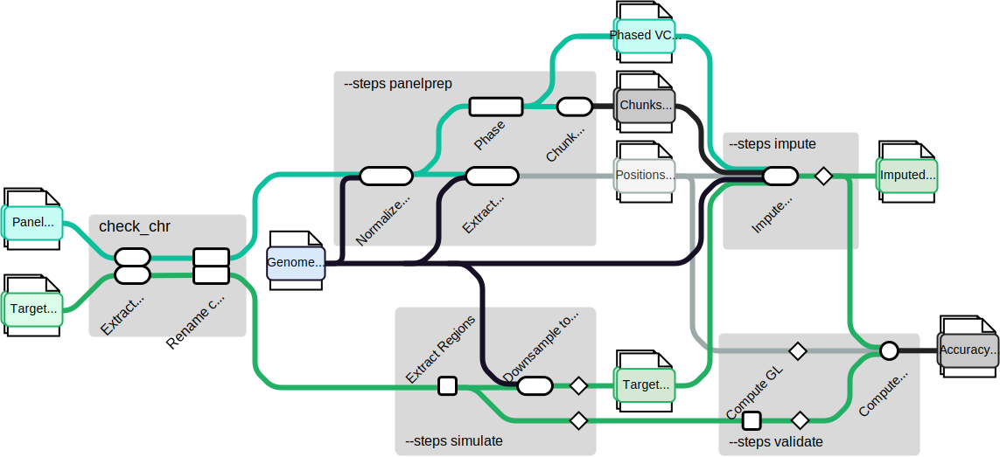

<h1>
  <picture>
    <source media="(prefers-color-scheme: dark)" srcset="docs/images/logo/nf-core-phaseimpute_logo_dark.png">
    
  </picture>
</h1>

**Multi-step pipeline dedicated to genetic imputation from simulation to validation**

[](https://github.com/nf-core/phaseimpute/actions/workflows/ci.yml)
[](https://github.com/nf-core/phaseimpute/actions/workflows/linting.yml) [](https://nf-co.re/phaseimpute/results) [](https://doi.org/10.5281/zenodo.XXXXXXX) [](https://www.nf-test.com)
[](https://www.nextflow.io/)
[](https://docs.conda.io/en/latest/)
[](https://www.docker.com/)
[](https://sylabs.io/docs/)
[](https://cloud.seqera.io/launch?pipeline=https://github.com/nf-core/phaseimpute)

[](https://nfcore.slack.com/channels/phaseimpute) [](https://twitter.com/nf_core) [](https://mstdn.science/@nf_core) [](https://www.youtube.com/c/nf-core)

## Introduction

**nf-core/phaseimpute** is a bioinformatics pipeline to phase and impute genetic data.



The whole pipeline consists of five main steps, each of which can be run separately and independently. Users are not required to run all steps sequentially and can select specific steps based on their needs:

1. **QC: Chromosome Name Check**: Ensures compatibility by validating that all expected contigs are present in the variant and alignment files.

2. **Simulation (`--simulate`)**: Generates artificial datasets by downsampling high-density data to simulate low-pass genetic information. This enables the comparison of imputation results against a high-quality dataset (truth set). Simulations may include:

   - **Low-pass data generation** by downsampling BAM or CRAM files with [`samtools view -s`](https://www.htslib.org/doc/samtools-view.html) at different depths.

3. **Panel Preparation (`--panelprep`)**: Prepares the reference panel through phasing, quality control, variant filtering, and annotation. Key processes include:

   - **Normalization** of the reference panel to retain essential variants.
   - **Phasing** of haplotypes in the reference panel using [Shapeit5](https://odelaneau.github.io/shapeit5/).
   - **Chunking** of the reference panel into specific regions across chromosomes.
   - **Position Extraction** for targeted imputation sites.

4. **Imputation (`--impute`)**: This is the primary step, where genotypes in the target dataset are imputed using the prepared reference panel. The main steps are:

   - **Imputation** of the target dataset using tools like [Glimpse1](https://odelaneau.github.io/GLIMPSE/glimpse1/index.html), [Glimpse2](https://odelaneau.github.io/GLIMPSE/), [Stitch](https://github.com/rwdavies/stitch), or [Quilt](https://github.com/rwdavies/QUILT).
   - **Ligation** of imputed chunks to produce a final VCF file per sample, with all chromosomes unified.

5. **Validation (`--validate`)**: Assesses imputation accuracy by comparing the imputed dataset to a truth dataset. This step leverages the [Glimpse2](https://odelaneau.github.io/GLIMPSE/) concordance process to summarize differences between two VCF files.

For more detailed instructions, please refer to the [usage documentation](https://nf-co.re/phaseimpute/usage).

## Usage

> [!NOTE]
> If you are new to Nextflow and nf-core, please refer to [this page](https://nf-co.re/docs/usage/installation) on how to set-up Nextflow. Make sure to [test your setup](https://nf-co.re/docs/usage/introduction#how-to-run-a-pipeline) with `-profile test` before running the workflow on actual data.

The primary function of this pipeline is to impute a target dataset based on a phased panel. Begin by preparing a samplesheet with your input data, formatted as follows:

```csv title="samplesheet.csv"
sample,file,index
SAMPLE_1X,/path/to/.<bam/cram>,/path/to/.<bai,crai>
```

Each row represents either a bam or a cram file along with its corresponding index file. Ensure that all input files have consistent file extensions.

For certain tools and steps within the pipeline, you will also need to provide a samplesheet for the reference panel. Here's an example of what a final samplesheet for a reference panel might look like, covering three chromosomes:

```csv title="panel.csv"
panel,chr,vcf,index
Phase3,1,ALL.chr1.phase3_shapeit2_mvncall_integrated_v5a.20130502.genotypes.vcf.gz,ALL.chr1.phase3_shapeit2_mvncall_integrated_v5a.20130502.genotypes.vcf.gz.csi
Phase3,2,ALL.chr2.phase3_shapeit2_mvncall_integrated_v5a.20130502.genotypes.vcf.gz,ALL.chr2.phase3_shapeit2_mvncall_integrated_v5a.20130502.genotypes.vcf.gz.csi
Phase3,3,ALL.chr3.phase3_shapeit2_mvncall_integrated_v5a.20130502.genotypes.vcf.gz,ALL.chr3.phase3_shapeit2_mvncall_integrated_v5a.20130502.genotypes.vcf.gz.csi
```

## Running the pipeline

Run one of the steps of the pipeline (imputation with glimpse1) using the following command and test profile:

```bash
nextflow run nf-core/phaseimpute \
   -profile test, <docker/singularity/.../institute> \
   --outdir <OUTDIR>
```

> [!WARNING]
> Please provide pipeline parameters via the CLI or Nextflow `-params-file` option. Custom config files including those provided by the `-c` Nextflow option can be used to provide any configuration _**except for parameters**_; see [docs](https://nf-co.re/docs/usage/getting_started/configuration#custom-configuration-files).

For more details and further functionality, please refer to the [usage documentation](https://nf-co.re/phaseimpute/usage) and the [parameter documentation](https://nf-co.re/phaseimpute/parameters).

## Pipeline output

To see the results of an example test run with a full size dataset refer to the [results](https://nf-co.re/phaseimpute/results) tab on the nf-core website pipeline page.
For more details on the output files and reports, please refer to the [output documentation](https://nf-co.re/phaseimpute/output).

## Credits

nf-core/phaseimpute was originally written by Louis Le Nézet & Anabella Trigila.

We thank the following people for their extensive assistance in the development of this pipeline:

- Saul Pierotti
- Eugenia Fontecha
- Matias Romero Victorica
- Hemanoel Passarelli

## Contributions and Support

If you would like to contribute to this pipeline, please see the [contributing guidelines](.github/CONTRIBUTING.md). Further development tips can be found in the [development documentation](docs/development.md).

For further information or help, don't hesitate to get in touch on the [Slack `#phaseimpute` channel](https://nfcore.slack.com/channels/phaseimpute) (you can join with [this invite](https://nf-co.re/join/slack)).

## Citations

<!-- TODO nf-core: Add citation for pipeline after first release. Uncomment lines below and update Zenodo doi and badge at the top of this file. -->

If you use nf-core/phaseimpute for your analysis, please cite it using the following doi: [10.5281/zenodo.XXXXXX](https://doi.org/10.5281/zenodo.XXXXXX)

An extensive list of references for the tools used by the pipeline, including QUILT, GLIMPSE, and STITCH, can be found in the [`CITATIONS.md`](CITATIONS.md) file.

You can cite the `nf-core` publication as follows:

> **The nf-core framework for community-curated bioinformatics pipelines.**
>
> Philip Ewels, Alexander Peltzer, Sven Fillinger, Harshil Patel, Johannes Alneberg, Andreas Wilm, Maxime Ulysse Garcia, Paolo Di Tommaso & Sven Nahnsen.
>
> _Nat Biotechnol._ 2020 Feb 13. doi: [10.1038/s41587-020-0439-x](https://dx.doi.org/10.1038/s41587-020-0439-x).
