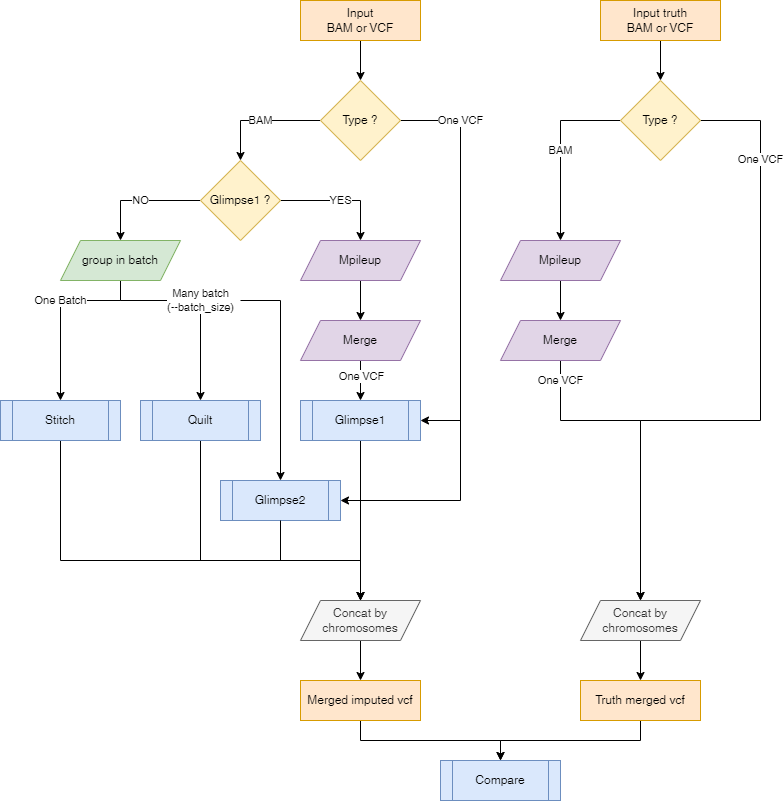

# nf-core/phaseimpute: Usage

## :warning: Please read this documentation on the nf-core website: [https://nf-co.re/phaseimpute/usage](https://nf-co.re/phaseimpute/usage)

> _Documentation of pipeline parameters is generated automatically from the pipeline schema and can no longer be found in markdown files._

## Introduction

<!-- TODO nf-core: Add documentation about anything specific to running your pipeline. For general topics, please point to (and add to) the main nf-core website. -->

## Samplesheet input

You will need to create a samplesheet with information about the samples you would like to analyse before running the pipeline. Use this parameter to specify its location. It has to be a comma-separated file with 3 columns, and a header row as shown in the examples below.

```bash
--input '[path to samplesheet file]'
```

### Structure

The samplesheet can have as many columns as you desire, however, there is a strict requirement for at least 3 columns to match those defined in the table below.

A final samplesheet file may look something like the one below. This is for 6 samples.

```console title="samplesheet.csv"
sample,file,index
SAMPLE1,AEG588A1.bam,AEG588A1.bai
SAMPLE2,AEG588A2.bam,AEG588A2.bai
SAMPLE3,AEG588A3.bam,AEG588A3.bai
SAMPLE4,AEG588A4.bam,AEG588A4.bai
SAMPLE5,AEG588A5.bam,AEG588A5.bai
SAMPLE6,AEG588A6.bam,AEG588A6.bai
```

| Column   | Description                                                                                                                                                                                    |
| -------- | ---------------------------------------------------------------------------------------------------------------------------------------------------------------------------------------------- |
| `sample` | Custom sample name. Spaces in sample names are automatically converted to underscores (`_`).                                                                                                   |
| `file`   | Full path to an alignment or variant file. File has to have the extension ".bam", ".cram" or ".vcf", ".bcf" optionally compressed with bgzip ".gz". All files need to have the same extension. |
| `index`  | Full path to index file. File has to be have the extension ".bai", ".crai", "csi", or "tbi". All files need to have the same extension.                                                        |

An [example samplesheet](../assets/samplesheet.csv) has been provided with the pipeline.

## Samplesheet reference panel

You will need to create a samplesheet with information about the reference panel you would like to use. Use this parameter to specify its location. It has to be a comma-separated file with 3 columns, and a header row as shown in the examples below.

```bash
--panel '[path to samplesheet file]'
```

### Structure

A final samplesheet file for the reference panel may look something like the one below. This is for 3 chromosomes.

```console title="samplesheet_reference.csv"
panel,chr,vcf,index
1000G,chr1,ALL.chr1.phase3_shapeit2_mvncall_integrated_v5a.20130502.genotypes.vcf.gz, ALL.chr1.phase3_shapeit2_mvncall_integrated_v5a.20130502.genotypes.vcf.gz.tbi
1000G,chr2,ALL.chr2.phase3_shapeit2_mvncall_integrated_v5a.20130502.genotypes.vcf.gz, ALL.chr2.phase3_shapeit2_mvncall_integrated_v5a.20130502.genotypes.vcf.gz.tbi
1000G,chr3,ALL.chr3.phase3_shapeit2_mvncall_integrated_v5a.20130502.genotypes.vcf.gz, ALL.chr3.phase3_shapeit2_mvncall_integrated_v5a.20130502.genotypes.vcf.gz.tbi
```

| Column  | Description                                                                                                    |
| ------- | -------------------------------------------------------------------------------------------------------------- |
| `panel` | Name of the reference panel used.                                                                              |
| `chr`   | Name of the chromosome. Use the prefix 'chr' if the panel uses the prefix.                                     |
| `vcf`   | Full path to a VCF file for that chromosome. File has to be gzipped and have the extension ".vcf.gz".          |
| `index` | Full path to the index for VCF file for that chromosome. File has to be gzipped and have the extension ".tbi". |

An [example samplesheet](../assets/samplesheet_reference.csv) has been provided with the pipeline.

## Samplesheet posfile

You will need a samplesheet with information about the reference panel sites for using the `--steps [impute,validate]`. You can generate this samplesheet from `--steps panelprep`. Use this parameter to specify its location. It has to be a comma-separated file with at least 5 columns, and a header row as shown in the examples below.

```bash
--posfile '[path to samplesheet file]'
```

### Structure

A final samplesheet file for the posfile may look something like the one below. This is for 2 chromosomes.

```console title="posfile.csv"
panel,chr,vcf,index,hap,legend
1000GP.s.norel,chr21,1000GP.chr21.s.norel.sites.vcf.gz,1000GP.chr21.s.norel.sites.vcf.gz.csi,1000GP.s.norel_chr21.hap.gz,1000GP.s.norel_chr21.legend.gz
1000GP.s.norel,chr22,1000GP.chr22.s.norel.sites.vcf.gz,1000GP.chr22.s.norel.sites.vcf.gz.csi,1000GP.s.norel_chr22.hap.gz,1000GP.s.norel_chr22.legend.gz
```

| Column   | Description                                                                                                                                                                                          |
| -------- | ---------------------------------------------------------------------------------------------------------------------------------------------------------------------------------------------------- |
| `panel`  | Name of the reference panel used.                                                                                                                                                                    |
| `chr`    | Name of the chromosome. Use the prefix 'chr' if the panel uses the prefix.                                                                                                                           |
| `vcf`    | Full path to a VCF containing the sites for that chromosome. File has to be gzipped and have the extension ".vcf.gz". (Required for validation step)                                                 |
| `index`  | Full path to the index for the VCF file for that chromosome. File has to be gzipped and have the extension ".tbi". (Necessary for validation step)                                                   |
| `hap`    | Full path to ".hap.gz" compressed file containing the reference panel haplotypes in ["haps" format](https://www.cog-genomics.org/plink/2.0/formats#haps). (Required by QUILT)                        |
| `legend` | Full path to ".legend.gz" compressed file containing the reference panel sites in ["legend" format](https://www.cog-genomics.org/plink/2.0/formats#legend). (Required by QUILT, GLIMPSE1 and STITCH) |

The `legend` file should be a TSV with the following structure, similar to that from [BCFTOOLS convert documentation](https://samtools.github.io/bcftools/bcftools.html#convert) with the `--haplegendsample` command : File is space separated with a header ("id,position,a0,a1"), one row per SNP, with the following columns:

- Column 1: chromosome:position_ref allele_alternate allele
- Column 2: physical position (sorted from smallest to largest)
- Column 3: reference base
- Column 4: alternate base

```csv title="legend.tsv"
id position a0 a1
chr21:16609287_C_T 16609287 C T
chr21:16609295_T_G 16609295 T G
chr21:16609345_A_T 16609345 A T
chr21:16609400_C_A 16609400 C A
chr21:16609437_G_A 16609437 G A
chr21:16609443_C_T 16609443 C T
chr21:16609476_A_G 16609476 A G
chr21:16609525_T_A 16609525 T A
```

## Genome reference

Remember to use the same reference genome for all the files. You can specify the [reference genome](https://nf-co.re/docs/usage/reference_genomes) using:

```bash
--genome GRCh37
```

or you can specify a custom genome using:

```bash
--fasta Homo_sapiens.GRCh38.dna_sm.primary_assembly.fa.gz
```

## Running the pipeline

The typical command for running the pre-processing of the panel and imputation of samples is as follows:

```bash
nextflow run nf-core/phaseimpute \
    --input samplesheet.csv \
    --steps panelprep,impute
    --outdir results \
    --genome GRCh37 \
    -profile docker
```

This will launch the pipeline, preparing the reference panel and performing imputation, with the `docker` configuration profile. See below for more information about profiles.

Note that the pipeline will create the following files in your working directory:

```bash
work                # Directory containing the nextflow working files
<OUTDIR>            # Finished results in specified location (defined with --outdir)
.nextflow_log       # Log file from Nextflow
# Other nextflow hidden files, eg. history of pipeline runs and old logs.
```

If you wish to repeatedly use the same parameters for multiple runs, rather than specifying each flag in the command, you can specify these in a params file.

Pipeline settings can be provided in a `yaml` or `json` file via `-params-file <file>`.

:::warning
Do not use `-c <file>` to specify parameters as this will result in errors. Custom config files specified with `-c` must only be used for [tuning process resource specifications](https://nf-co.re/docs/usage/configuration#tuning-workflow-resources), other infrastructural tweaks (such as output directories), or module arguments (args).
:::

The above pipeline run specified with a params file in yaml format:

```bash
nextflow run nf-core/phaseimpute -profile docker -params-file params.yaml
```

with:

```yaml title="params.yaml"
input: './samplesheet.csv'
outdir: './results/'
genome: 'GRCh37'
<...>
```

You can also generate such `YAML`/`JSON` files via [nf-core/launch](https://nf-co.re/launch).

### Check of the contigs name

The pipeline parallelize the imputation process across contigs. To do so it will use either the `--regions` samplesheet or the `.fai` to extract the genomic region to process.
From all those contigs some might not be present in the `--panel`, `--posfile`, `--chunks`, `--map` (column `chr`) or in the `--fasta`. In this case the pipeline will warn you that some of the contigs are absent in some of the file specified and will only parallelize on the intersection of all contigs.
Afterwards the remaining contigs presence will be checked with the `CHECKCHR` pipeline to ensure that they are present in each `--input` and `--input_truth` file and that also in the individuals reference panel files.

### Running the pipeline

nf-core/phaseimpute can be started at different points in the analysis by setting the flag `--steps` and the available options `[simulate, panelprep, impute, validate, all]`. You can also run several steps simultaneously by listing the required processes as `--steps panelprep,impute` or you can choose to run all steps sequentially by using `--steps all`.

### Start with simulation `--steps simulate`

This steps of the pipeline allows to create synthetic low-coverage input files by downsizing high density input data. A typical use case is to obtain low-coverage input data from a sequenced sample. This method is useful for comparing the imputation results to the truth and evaluate the quality of the imputation. You can skip this steps if you already have low-pass genome sequencing data. A sample command for this steps is:

```bash
nextflow run nf-core/phaseimpute \
    --input samplesheet.csv \
    --steps simulate \
    --depth 1 \
    --outdir results \
    --genome GRCh37 \
    -profile docker
```

The required flags for this mode are:

- `--steps simulate`: The steps to run.
- `--input samplesheet.csv`: The samplesheet containing the input sample files in `bam` or `cram `format.
- `--depth`: The final depth of the file [default: 1].
- `--genome` or `--fasta`: The reference genome of the samples.

You can find an overview of the results produced by this step in the [Output](output.md).

### Start with panel preparation `--steps panelprep`

This steps pre-processes the reference panel in order to be ready for imputation. There are a few quality control steps that are applied to reference panels. These include actions such as removing multiallelic SNPs and indels and removing certain samples from the reference panel (such as related samples). In addition, chunks are produced which are then used in the imputation steps. It is recommended that this steps is run once and the produced files are saved, to minimize the cost of reading the reference panel each time. Then, the output files from `--steps panelprep` can be used as input in the subsequent imputation steps, such as `--steps impute`.

For starting from panel preparation, the required flags are `--steps panelprep` and `--panel samplesheet_reference.csv`.

```bash
nextflow run nf-core/phaseimpute \
    --input samplesheet.csv \
    --panel samplesheet_reference.csv \
    --steps panelprep --outdir results \
    --genome GRCh37 -profile docker
```

The required flags for this mode are:

- `--steps panelprep`: The steps to run.
- `--panel reference.csv`: The samplesheet containing the reference panel files in `vcf.gz` format.
- `--phase`: (optional) Whether the reference panel should be phased (true|false).
- `--normalize`: (optional) Whether the reference panel needs to be normalized or not (true|false). Default is true.
- `--remove_samples`: (optional) A comma-separated list of samples to remove from the reference during the normalization process.
- `--compute_freq`: (optional) Whether the frequency (AC/AN field) for each variants needs to be computed or not (true/false). This can be the case if the frequency is absent from the reference panel or if individuals have been removed.

You can find an overview of the results produced by this steps in the [Output](output.md).

### Start with imputation `--steps impute`

For starting from the imputation steps, the required flags are:

- `--steps impute`
- `--input input.csv`: The samplesheet containing the input sample files in `bam`, `cram` or `vcf`, `bcf` format.
- `--genome` or `--fasta`: The reference genome of the samples.
- `--tools [glimpse1, quilt, stitch]`: A selection of one or more of the available imputation tools. Each imputation tool has their own set of specific flags and input files. These required files are produced by `--steps panelprep` and used as input in:

  - `--chunks chunks.csv`: A samplesheet containing chunks per chromosome. These are produced by `--steps panelprep` using `GLIMPSE1`.
  - `--posfile posfile.csv`: A samplesheet containing a `.legend.gz` file with the list of positions to genotype per chromosome. These are required by tools ( QUILT/STITCH/GLIMPSE1). It can also contain the `hap.gz` files (required by QUILT). The posfile can be generated with `--steps panelprep`.
  - `--panel panel.csv`: A samplesheet containing the post-processed reference panel VCF (required by GLIMPSE1, GLIMPSE2). These files can be obtained with `--steps panelprep`.

#### Summary table of required parameters in `--steps impute`

|            | `--steps impute` | `--input` | `--genome` or `--fasta` | `--panel` | `--chunks` | `--posfile` |
| ---------- | ---------------- | --------- | ----------------------- | --------- | ---------- | ----------- |
| `GLIMPSE1` | ✅               | ✅ ¹      | ✅                      | ✅        | ✅         | ✅ ³        |
| `GLIMPSE2` | ✅               | ✅ ¹      | ✅                      | ✅        | ✅         | ❌          |
| `QUILT`    | ✅               | ✅ ²      | ✅                      | ❌        | ✅         | ✅ ⁴        |
| `STITCH`   | ✅               | ✅ ²      | ✅                      | ❌        | ❌         | ✅ ³        |

> ¹ Alignment files as well as variant calling format (i.e. BAM, CRAM, VCF or BCF)
> ² Alignment files only (i.e. BAM or CRAM)
> ³ `QUILT`: Should be a CSV with columns [panel id, chr, hap, legend]
> ⁴ `GLIMPSE1 and STITCH`: Should be a CSV with columns [panel id, chr, legend]

Here is a representation on how the input files will be processed depending on the input files type and the selected imputation tool.

[](./images/InputSoftware_compatibility.png)

#### Argument `--batch_size`

The `--batch_size` argument is used to specify the number of samples to be processed at once. This is useful when the number of samples is large and the memory is limited. The default value is 100 but it might need to be adapted to the size of each individuals data, the number of samples to be processed in parallel and the available memory.

Imputation softwares algorithm are time consuming. The computational load depend on the number of individuals, the region size and the panel size. [Some steps are computationally fixed](https://doi.org/10.1038/s41588-023-01438-3), meaning they run similarly whether you are imputing 2 individuals or 200. By grouping individuals into larger batches, these fixed-cost steps are shared among more samples, reducing the per-individual computational overhead and improving overall efficiency. This step is recommended
On the other hand we also need to limit the memory usage when working with a huge amount of individuals within a process.
Hence the necessity to use a batch_size large enough to reduce the fixed-cost stepts / individuals and not to large for the memory usage to be sustainable.

When the number of samples exceeds the batch size, the pipeline will split the samples into batches and process them sequentially. The files used in each batch are stored in the `${outputdir}/imputation/batch` folder.
[STITCH](#stitch) and [GLIMPSE1](#glimpse1) do not support a batch size inferior to the number of samples. This limit is set up to not induce batch effect in the imputation process, as this two tools take into account the information of the target file to perform the imputation. This does on the other hand enhances the accuracy of phasing and imputation, as the target individuals might provide more informative genetic context (e.g. you have related individuals in the target).

To summarize:

- If you have Variant Calling Format file you should join them in one and choose either GLIMPSE1 or GLIMPSE2
- If you have alignment files all the tools are available and their will be processed in batch_size
  - Glimpse1 and Stitch might induce batch effect so all the samples need to be imputed together
  - Glimpse2 and Quilt can process the samples in different batches
- If you want to disable this option and run each sample separately you can set `--batch_size 1`

#### Imputation tools `--steps impute --tools [glimpse1, glimpse2, quilt, stitch]`

You can choose different software to perform the imputation. In the following sections, the typical commands for running the pipeline with each software are included. Multiple tools can be selected by separating them with a comma (eg. `--tools glimpse1,quilt`).

##### QUILT

[QUILT](https://github.com/rwdavies/QUILT) is an R and C++ program for rapid genotype imputation from low-coverage sequence using a large reference panel. The required inputs for this program are bam samples provided in the input samplesheet (`--input`) and a csv file with the genomic chunks (`--chunks`).

```bash
nextflow run nf-core/phaseimpute \
    --input samplesheet.csv \
    --posfile posfile.csv \
    --chunks chunks.csv \
    --steps impute \
    --tools quilt \
    --outdir results \
    --genome GRCh37 \
    -profile docker
```

The csv provided in `--posfile` must contain at least four columns [panel, chr, hap, legend]. The first column is the name of the panel, the second is the chromosome, then the hap and legend files produced by `--steps panelprep` unique to each chromosome. The hap and legend files are mandatory to use QUILT.

```console title="posfile.csv"
panel,chr,hap,legend
1000GP,chr22,1000GP.s.norel_chr22.hap.gz,1000GP.s.norel_chr22.legend.gz
```

The csv provided in `--chunks` must contain two columns [chr, file]. The first column is the chromosome and the file column are txt with the chunks produced by GLIMPSE1, unique to each chromosome.

```console title="chunks.csv"
panel,chr,file
1000GP,chr1,chunks_chr1.txt
1000GP,chr2,chunks_chr2.txt
1000GP,chr3,chunks_chr3.txt
```

The file column should contain a TXT/TSV obtained from GLIMPSE1 with the following [structure](https://github.com/nf-core/test-datasets/blob/phaseimpute/hum_data/panel/chr22/1000GP.chr22_chunks.txt).

If you do not have a csv with chunks, you can provide a reference panel to run the `--steps panelprep` which produces a csv with these chunks, which is then used as input for QUILT. You can choose to run both steps sequentially as `--steps panelprep,impute` or simply collect the files produced by `--steps panelprep`.

```bash
nextflow run nf-core/phaseimpute \
    --input samplesheet.csv \
    --steps panelprep,impute \
    --tools quilt \
    --panel samplesheet_reference.csv \
    --outdir results \
    --genome GRCh37 \
    -profile docker
```

##### STITCH

[STITCH](https://github.com/rwdavies/STITCH) is an R program for low coverage sequencing genotype imputation without using a reference panel. The required inputs for this program are bam samples provided in the input samplesheet (`--input`) and a `.legend.gz` file with the list of positions to genotype (`--posfile`). See [Posfile section](#samplesheet-posfile) for more information.

If you do not have a list of position to genotype, you can provide a reference panel to run the `--steps panelprep` which produces a tsv with this list.

```bash
nextflow run nf-core/phaseimpute \
    --input samplesheet.csv \
    --steps panelprep \
    --panel samplesheet_reference.csv \
    --outdir results \
    --genome GRCh37 \
    -profile docker
```

Otherwise, you can provide your own position file in the `--steps impute` with STITCH using the the `--posfile` parameter.

```bash
nextflow run nf-core/phaseimpute \
    --input samplesheet.csv \
    --steps impute \
    --posfile posfile.csv  \
    --tool stitch \
    --outdir results \
    --genome GRCh37 \
    -profile docker
```

The csv provided in `--posfile` must contain three columns [panel, chr, legend]. See [Posfile section](#samplesheet-posfile) for more information.

```console title="posfile.csv"
panel,chr,legend
1000GP,chr22,1000GP.s.norel_chr22.legend.gz
```

STITCH only handles bi-allelic SNPs.

If you do not have a reference panel and you would like to obtain the posfile you can use the following command:

```bash
bcftools view -G -m 2 -M 2 -v ${vcf}
bcftools convert --haplegendsample ${vcf}
```

##### GLIMPSE1

[GLIMPSE1](https://github.com/odelaneau/GLIMPSE/tree/glimpse1) is a set of tools for phasing and imputation for low-coverage sequencing datasets. Recommended for many samples at >0.5x coverage and small reference panels. Glimpse1 works with alignment (i.e. BAM or CRAM) as well as variant (i.e. VCF or BCF) files as input. This is an example command to run this tool from the `--steps impute`:

```bash
nextflow run nf-core/phaseimpute \
    --input samplesheet.csv \
    --panel samplesheet_reference.csv \
    --steps impute \
    --tool glimpse1 \
    --outdir results \
    --genome GRCh37 \
    -profile docker \
    --posfile posfile.csv
    --chunks chunks.csv
```

The csv provided in `--posfile` must contain three columns [panel, chr, legend]. See [Posfile section](#samplesheet-posfile) for more information.

```console title="posfile.csv"
panel,chr,legend
1000GP,chr22,1000GP.s.norel_chr22.legend.gz
```

The csv provided in `--panel` must be prepared with `--steps panelprep` and must contain two columns [panel, chr, vcf, index].

##### GLIMPSE2

[GLIMPSE2](https://github.com/odelaneau/GLIMPSE) is a set of tools for phasing and imputation for low-coverage sequencing datasets. This is an example command to run this tool from the `--steps impute`:

```bash
nextflow run nf-core/phaseimpute \
    --input samplesheet.csv \
    --panel samplesheet_reference.csv \
    --steps impute \
    --tool glimpse2 \
    --outdir results \
    --chunks chunks.csv \
    --genome GRCh37 \
    -profile docker
```

Make sure the csv with the input panel is the output from `--step panelprep` or has been previously prepared.

### Start with validation `--steps validate`

This steps compares a _truth_ VCF to an _imputed_ VCF in order to compute imputation accuracy.
This also needs the frequency of the alleles. They can be computed from the reference panel by running the `--steps panelprep` and using the `--panel` with the `--compute_freq` flag ; or by using `--posfile samplesheet.csv`.

```bash
nextflow run nf-core/phaseimpute \
    --input samplesheet.csv \
    --input_truth truth.csv \
    --posfile posfile.csv \
    --steps validate \
    --outdir results \
    --genome GRCh37 \
    -profile docker
```

The required flags for this mode only are:

- `--steps validate`: The steps to run.
- `--input input.csv`: The samplesheet containing the input sample files in `vcf` or `bcf` format.
- `--input_truth input_truth.csv`: The samplesheet containing the truth VCF files in `vcf` format.
  This can also accept `bam` or `cram` files as input but will need the additional `legend` file in the `--posfile` to call the variants.
  The structure of the `input_truth.csv` is the same as the `input.csv` file. See [Samplesheet input](#samplesheet-input) for more information.
- `--posfile posfile.csv`: A samplesheet containing the panel sites informations in `vcf` format for each chromosome.

The csv provided in `--posfile` must contain three columns [panel, chr, vcf, index]. See [Posfile section](#samplesheet-posfile) for more information.

```console title="posfile.csv"
panel,chr,vcf,index
1000GP,chr22,1000GP.s.norel_chr22.sites.vcf.gz,1000GP.s.norel_chr22.sites.csi
```

### Run all steps sequentially `--steps all`

This mode runs all the previous steps. This requires several flags:

- `--steps all`: The steps to run.
- `--input input.csv`: The samplesheet containing the input sample files in `bam` or `cram` format.
- `--depth`: The final depth of the input file [default: 1].
- `--genome` or `--fasta`: The reference genome of the samples.
- `--tools [glimpse1, glimpse2, quilt, stitch]`: A selection of one or more of the available imputation tools.
- `--panel panel.csv`: The samplesheet containing the reference panel files in `vcf.gz` format.
- `--remove_samples`: (optional) A comma-separated list of samples to remove from the reference.
- `--input_truth input_truth.csv`: The samplesheet containing the truth VCF files in `vcf` format.
  This can also accept `bam` or `cram` files as input but will need the additional `legend` file in the `--posfile` to call the variants.
  The structure of the `input_truth.csv` is the same as the `input.csv` file. See [Samplesheet input](#samplesheet-input) for more information.

### Updating the pipeline

When you run the above command, Nextflow automatically pulls the pipeline code from GitHub and stores it as a cached version. When running the pipeline after this, it will always use the cached version if available - even if the pipeline has been updated since. To make sure that you're running the latest version of the pipeline, make sure that you regularly update the cached version of the pipeline:

```bash
nextflow pull nf-core/phaseimpute
```

### Reproducibility

It is a good idea to specify a pipeline version when running the pipeline on your data. This ensures that a specific version of the pipeline code and software are used when you run your pipeline. If you keep using the same tag, you'll be running the same version of the pipeline, even if there have been changes to the code since.
It is a good idea to specify a pipeline version when running the pipeline on your data. This ensures that a specific version of the pipeline code and software are used when you run your pipeline. If you keep using the same tag, you'll be running the same version of the pipeline, even if there have been changes to the code since.

First, go to the [nf-core/phaseimpute releases page](https://github.com/nf-core/phaseimpute/releases) and find the latest pipeline version - numeric only (eg. `1.3.1`). Then specify this when running the pipeline with `-r` (one hyphen) - eg. `-r 1.3.1`. Of course, you can switch to another version by changing the number after the `-r` flag.
First, go to the [nf-core/phaseimpute releases page](https://github.com/nf-core/phaseimpute/releases) and find the latest pipeline version - numeric only (eg. `1.3.1`). Then specify this when running the pipeline with `-r` (one hyphen) - eg. `-r 1.3.1`. Of course, you can switch to another version by changing the number after the `-r` flag.

This version number will be logged in reports when you run the pipeline, so that you'll know what you used when you look back in the future. For example, at the bottom of the MultiQC reports.

To further assist in reproducbility, you can use share and re-use [parameter files](#running-the-pipeline) to repeat pipeline runs with the same settings without having to write out a command with every single parameter.

:::tip
If you wish to share such profile (such as upload as supplementary material for academic publications), make sure to NOT include cluster specific paths to files, nor institutional specific profiles.
:::

## Core Nextflow arguments

:::note
These options are part of Nextflow and use a _single_ hyphen (pipeline parameters use a double-hyphen).
:::

### `-profile`

Use this parameter to choose a configuration profile. Profiles can give configuration presets for different compute environments.

Several generic profiles are bundled with the pipeline which instruct the pipeline to use software packaged using different methods (Docker, Singularity, Podman, Shifter, Charliecloud, Apptainer, Conda) - see below.
Several generic profiles are bundled with the pipeline which instruct the pipeline to use software packaged using different methods (Docker, Singularity, Podman, Shifter, Charliecloud, Apptainer, Conda) - see below.

:::info
We highly recommend the use of Docker or Singularity containers for full pipeline reproducibility, however when this is not possible, Conda is also supported.
:::

The pipeline also dynamically loads configurations from [https://github.com/nf-core/configs](https://github.com/nf-core/configs) when it runs, making multiple config profiles for various institutional clusters available at run time. For more information and to see if your system is available in these configs please see the [nf-core/configs documentation](https://github.com/nf-core/configs#documentation).

Note that multiple profiles can be loaded, for example: `-profile test,docker` - the order of arguments is important!
They are loaded in sequence, so later profiles can overwrite earlier profiles.

If `-profile` is not specified, the pipeline will run locally and expect all software to be installed and available on the `PATH`. This is _not_ recommended, since it can lead to different results on different machines dependent on the computer enviroment.

- `test`
  - A profile with a complete configuration for automated testing
  - Includes links to test data so needs no other parameters
- `docker`
  - A generic configuration profile to be used with [Docker](https://docker.com/)
- `singularity`
  - A generic configuration profile to be used with [Singularity](https://sylabs.io/docs/)
- `podman`
  - A generic configuration profile to be used with [Podman](https://podman.io/)
- `shifter`
  - A generic configuration profile to be used with [Shifter](https://nersc.gitlab.io/development/shifter/how-to-use/)
- `charliecloud`
  - A generic configuration profile to be used with [Charliecloud](https://hpc.github.io/charliecloud/)
- `apptainer`
  - A generic configuration profile to be used with [Apptainer](https://apptainer.org/)
- `wave`
  - A generic configuration profile to enable [Wave](https://seqera.io/wave/) containers. Use together with one of the above (requires Nextflow ` 24.03.0-edge` or later).
- `conda`
  - A generic configuration profile to be used with [Conda](https://conda.io/docs/). Please only use Conda as a last resort i.e. when it's not possible to run the pipeline with Docker, Singularity, Podman, Shifter, Charliecloud, or Apptainer.

### `-resume`

Specify this when restarting a pipeline. Nextflow will use cached results from any pipeline steps where the inputs are the same, continuing from where it got to previously. For input to be considered the same, not only the names must be identical but the files' contents as well. For more info about this parameter, see [this blog post](https://www.nextflow.io/blog/2019/demystifying-nextflow-resume.html).
Specify this when restarting a pipeline. Nextflow will use cached results from any pipeline steps where the inputs are the same, continuing from where it got to previously. For input to be considered the same, not only the names must be identical but the files' contents as well. For more info about this parameter, see [this blog post](https://www.nextflow.io/blog/2019/demystifying-nextflow-resume.html).

You can also supply a run name to resume a specific run: `-resume [run-name]`. Use the `nextflow log` command to show previous run names.

### `-c`

Specify the path to a specific config file (this is a core Nextflow command). See the [nf-core website documentation](https://nf-co.re/usage/configuration) for more information.

## Custom configuration

### Resource requests

Whilst the default requirements set within the pipeline will hopefully work for most people and with most input data, you may find that you want to customise the compute resources that the pipeline requests. Each steps in the pipeline has a default set of requirements for number of CPUs, memory and time. For most of the steps in the pipeline, if the job exits with any of the error codes specified [here](https://github.com/nf-core/rnaseq/blob/4c27ef5610c87db00c3c5a3eed10b1d161abf575/conf/base.config#L18) it will automatically be resubmitted with higher requests (2 x original, then 3 x original). If it still fails after the third attempt then the pipeline execution is stopped.

To change the resource requests, please see the [max resources](https://nf-co.re/docs/usage/configuration#max-resources) and [tuning workflow resources](https://nf-co.re/docs/usage/configuration#tuning-workflow-resources) section of the nf-core website.

### Custom Containers

In some cases you may wish to change which container or conda environment a steps of the pipeline uses for a particular tool. By default nf-core pipelines use containers and software from the [biocontainers](https://biocontainers.pro/) or [bioconda](https://bioconda.github.io/) projects. However in some cases the pipeline specified version maybe out of date.

To use a different container from the default container or conda environment specified in a pipeline, please see the [updating tool versions](https://nf-co.re/docs/usage/configuration#updating-tool-versions) section of the nf-core website.

### Custom Tool Arguments

A pipeline might not always support every possible argument or option of a particular tool used in pipeline. Fortunately, nf-core pipelines provide some freedom to users to insert additional parameters that the pipeline does not include by default.

One of the parameters that you might want to modify could be specific to each imputation software. As an example, running the pipeline, you may encounter that to reduce the impact of individual reads (for example in QUILT), you might need to lower coverage. This can be achieved by including any modification to a Nextflow process as an external argument using `ext.args`. You would customize the run by providing:

```
process {
  withName:'NFCORE_PHASEIMPUTE:PHASEIMPUTE:BAM_IMPUTE_QUILT:QUILT_QUILT' {
    ext.args = "--downsampleToCov=1"
  }
}
```

To learn how to provide additional arguments to a particular tool of the pipeline, please see the [customising tool arguments](https://nf-co.re/docs/usage/configuration#customising-tool-arguments) section of the nf-core website.

### nf-core/configs

In most cases, you will only need to create a custom config as a one-off but if you and others within your organisation are likely to be running nf-core pipelines regularly and need to use the same settings regularly it may be a good idea to request that your custom config file is uploaded to the `nf-core/configs` git repository. Before you do this please can you test that the config file works with your pipeline of choice using the `-c` parameter. You can then create a pull request to the `nf-core/configs` repository with the addition of your config file, associated documentation file (see examples in [`nf-core/configs/docs`](https://github.com/nf-core/configs/tree/master/docs)), and amending [`nfcore_custom.config`](https://github.com/nf-core/configs/blob/master/nfcore_custom.config) to include your custom profile.

See the main [Nextflow documentation](https://www.nextflow.io/docs/latest/config.html) for more information about creating your own configuration files.

If you have any questions or issues please send us a message on [Slack](https://nf-co.re/join/slack) on the [`#configs` channel](https://nfcore.slack.com/channels/configs).

## Running in the background

Nextflow handles job submissions and supervises the running jobs. The Nextflow process must run until the pipeline is finished.

The Nextflow `-bg` flag launches Nextflow in the background, detached from your terminal so that the workflow does not stop if you log out of your session. The logs are saved to a file.

Alternatively, you can use `screen` / `tmux` or similar tool to create a detached session which you can log back into at a later time.
Some HPC setups also allow you to run nextflow within a cluster job submitted your job scheduler (from where it submits more jobs).

## Nextflow memory requirements

In some cases, the Nextflow Java virtual machines can start to request a large amount of memory.
We recommend adding the following line to your environment to limit this (typically in `~/.bashrc` or `~./bash_profile`):

```bash
NXF_OPTS='-Xms1g -Xmx4g'
```

Specify the path to a specific config file (this is a core Nextflow command). See the [nf-core website documentation](https://nf-co.re/usage/configuration) for more information.
